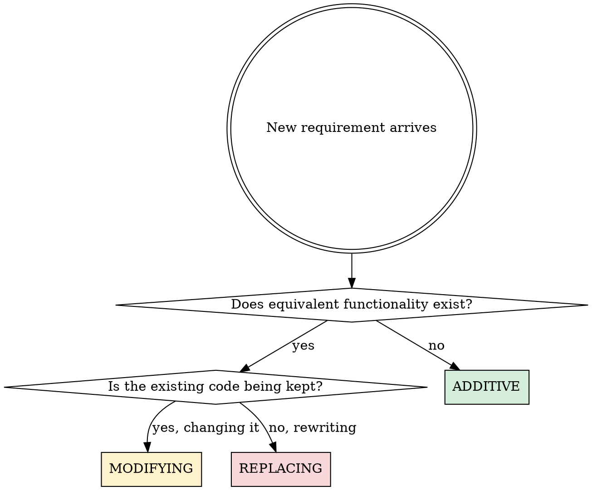
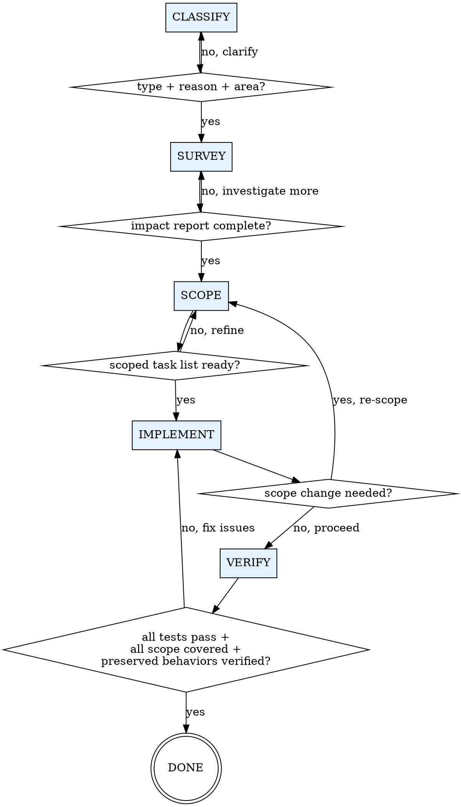

# Handle Requirement Change

## Overview

Requirement changes break things when agents skip impact analysis and jump straight to implementation — whether that's writing code, modifying prompts, tuning reward functions, or changing training pipelines.

**Core principle:** ALWAYS analyze impact and scope before implementing. ALWAYS verify preserved behaviors before claiming done. This applies to ALL domains: traditional software, LLM applications, RL training, ML pipelines, and AI agent systems.

**Violating the letter of this process is violating the spirit of handling requirement changes.**

## The Iron Law

```
NO IMPLEMENTATION WITHOUT IMPACT ANALYSIS FIRST.
NO CLAIMING DONE WITHOUT VERIFYING PRESERVED BEHAVIORS.
```

If you haven't completed Phase 2, you cannot write implementation code.

## When to Use

Use for ANY requirement change across ALL domains:

**Software development:**
- "Add X feature" / "Change how Y works" / "Redo Z"
- PM/user provides new or revised specs
- Scope expansion during implementation

**LLM / Prompt engineering:**
- "Change the system prompt to..." / "Add a new tool/function"
- "Switch from GPT-4 to Claude" / "Add guardrails for..."
- "Modify the RAG pipeline" / "Change output format"
- Prompt versioning, model migration, safety constraint changes

**RL / Training:**
- "Modify the reward function" / "Change the observation space"
- "Add a constraint to the policy" / "Switch training curriculum"
- Reward shaping changes, environment modifications, hyperparameter updates

**ML pipelines:**
- "Change the loss function" / "Add a new data source"
- "Modify the feature engineering" / "Update the model architecture"
- Schema changes, evaluation metric changes, data augmentation updates

**AI agent development:**
- "Add a new tool/capability" / "Change the orchestration logic"
- "Modify memory management" / "Add multi-agent coordination"
- Tool definitions, safety guardrails, context window management

**Use this ESPECIALLY when:**
- The change touches code/config that other features depend on
- You're modifying behavior that has existing tests or baselines
- The user says "just quickly add/change..."
- You're in the middle of implementing something else
- The change seems "small" or "obvious"
- **AI/ML specific:** The change involves non-deterministic components (LLMs, RL policies, model outputs)

## Change Classification

First, classify the change. This determines your investigation depth.

| Type | Definition | Key Risk | Survey Depth |
|------|-----------|----------|-------------|
| **ADDITIVE** | Brand new functionality | Integration point conflicts | Medium |
| **MODIFYING** | Change existing behavior | Breaking dependent modules | High |
| **REPLACING** | Rewrite with new implementation | Losing implicit behaviors | Highest |



## The Five Phases

You MUST complete each phase before proceeding to the next. Each phase has a **hard gate** — a condition that must be true before you can advance.

### Phase 1: CLASSIFY

**Purpose:** Understand what kind of change this is and why.

**Actions:**
1. Identify change type: ADDITIVE / MODIFYING / REPLACING
2. Capture the business context — WHY is this change being made?
3. Record the user's exact request (quote their words)
4. Identify the affected area at a high level

**Hard gate:** You can state the change type, the reason, and the affected area.

**Output:** Structured classification (use `templates/change-request.md` for format).

---

### Phase 2: SURVEY

**Purpose:** Analyze what exists and what will be affected.

<HARD-GATE>
Do NOT write any implementation code until Phase 2 is complete. Reading and analyzing code is NOT implementing. Writing new code or modifying existing files IS implementing.
</HARD-GATE>

**Actions:**
1. Read existing specs/docs for the affected area (if they exist)
2. Use Grep/Glob to find ALL files that reference the affected code
3. Identify all tests that cover the affected area
4. For MODIFYING/REPLACING: read and summarize current behavior BEFORE touching anything
5. Check for conflicts between new requirements and existing ones
6. Document existing patterns and conventions in the affected area

**Depth by change type:**
- ADDITIVE: Find integration points, check naming conventions, identify similar features to follow as patterns
- MODIFYING: All of above PLUS map every caller/consumer of the code being changed, list behaviors to preserve
- REPLACING: All of above PLUS create complete inventory of old code's behaviors (explicit AND implicit)

**AI/ML additional survey actions:**
- **LLM/Prompt changes:** Check all downstream consumers of LLM output, verify output format contracts, review evaluation baselines, check if prompt changes affect other prompts in chain
- **RL changes:** Check reward signal propagation, verify environment-agent interface compatibility, document current training metrics as baseline, identify curriculum dependencies
- **ML pipeline changes:** Verify data schema compatibility upstream and downstream, check feature store dependencies, document current model performance baselines
- **Framework migration:** Map ALL API surface area used from old framework, identify framework-specific patterns that don't translate 1:1, check for implicit behaviors in old framework defaults
- **New algorithm/baseline:** Document existing baseline metrics, identify evaluation infrastructure needed, check data pipeline compatibility with new algorithm's requirements

**Hard gate:** You have a written impact report covering files, tests, conflicts, and patterns.

**Output:** Impact report (use `templates/impact-report.md` for format).

---

### Phase 3: SCOPE

**Purpose:** Draw explicit boundaries — what changes, what doesn't, what must be preserved.

**Actions:**
1. Define task list with specific file changes needed
2. Mark explicit "DO NOT TOUCH" boundaries
3. For MODIFYING/REPLACING: list every behavior that MUST be preserved
4. Identify integration points where new code meets existing code
5. Scope creep check: does this change exceed the original request? Flag if yes.
6. Order tasks by dependency (what must be done first)

**Hard gate:** You have a scoped task list with explicit preservation requirements and "do not touch" boundaries.

**Output:** Scope document (use `templates/scope-document.md` for format).

---

### Phase 4: IMPLEMENT

**Purpose:** Execute the scoped changes incrementally with continuous verification.

**Rules:**
1. Follow the task list from Phase 3 in order
2. After EACH task: verify consistency with existing patterns found in Phase 2
3. After EACH task: run relevant tests (not just new tests — existing tests too)
4. Update tests and docs ALONGSIDE code, not after — they are part of the same task
5. For MODIFYING/REPLACING: never delete old behavior before new behavior is verified working
6. If you discover the scope needs to change: STOP and return to Phase 3

**Incremental checkpoint after each task:**
- [ ] Code follows existing patterns from Phase 2?
- [ ] Relevant tests pass?
- [ ] Tests/docs updated for this change?
- [ ] "DO NOT TOUCH" boundaries respected?

**AI/ML additional checkpoints:**
- [ ] Evaluation metrics compared against Phase 2 baselines?
- [ ] Non-deterministic outputs sampled multiple times (not just once)?
- [ ] Data pipeline compatibility verified end-to-end?
- [ ] No train-serve skew introduced?

---

### Phase 5: VERIFY

**Purpose:** Confirm everything works and nothing is broken.

<HARD-GATE>
Do NOT claim the work is done until ALL items below are verified.
</HARD-GATE>

**Actions:**
1. Run full test suite — ALL tests, not just new/changed ones
2. Check every item from Phase 3 scope: is it addressed?
3. Check every "DO NOT TOUCH" item: is it actually untouched?
4. For MODIFYING/REPLACING: verify EACH preserved behavior still works
5. Confirm docs/specs are updated to reflect the change
6. Summarize what was changed and what was preserved

**Hard gate:** All tests pass, all scope items addressed, all preserved behaviors verified.

**Related skill:** Use `superpowers:verification-before-completion` for the final gate.

## Process Flow



## Red Flags — STOP and Follow Process

If you catch yourself thinking:

| Rationalization | Reality |
|----------------|---------|
| "This is a small change, skip impact analysis" | Small changes in coupled code cause the worst regressions |
| "I already know what files are affected" | Memory-based assessment misses transitive dependencies. Use Grep/Glob. |
| "I'll update tests/docs after the code works" | "After" never comes. Update alongside implementation. |
| "Old code is being replaced, no need to understand it" | Can't verify replacement completeness without understanding the original |
| "This is additive, nothing existing is affected" | New features interact with existing code at integration points |
| "User said to do it quickly" | 5 minutes of analysis prevents hours of debugging |
| "I'm already mid-implementation, going back is wasteful" | Sunk cost fallacy. Incomplete analysis causes more rework than going back. |
| "The test suite will catch any issues" | Test suites have gaps. Phase 2 survey finds what tests DON'T cover. |
| "This doesn't need a scope document for such a simple change" | Simple changes need simple scope docs. The doc is fast to write if the change is truly simple. |
| "It's just a prompt change, not real code" | Prompt changes affect all downstream parsers and evaluations. Non-deterministic = higher risk, not lower. |
| "The model will figure it out" | Models don't compensate for broken pipelines. Verify explicitly. |
| "I'll just run a quick training to see if it works" | Training without baseline comparison tells you nothing. Document baselines in Phase 2 first. |
| "The old framework is being replaced anyway" | Framework defaults differ in invisible ways. Map the full API surface before migrating. |
| "Published results prove this algorithm works" | Published results are on their data/setup. Reproduce baselines on YOUR setup first. |

**ALL of these mean: STOP. Return to the appropriate phase.**

## Change-Type Specific Guidance

### ADDITIVE (New Features)

**Key technique: Pattern Matching**
1. Find the most similar existing feature in the codebase
2. Study its structure: file organization, naming, patterns, error handling
3. Follow the same conventions for the new feature
4. Identify integration points: where does new code connect to existing code?

**Common mistake:** Building in isolation without following existing patterns, then needing to refactor to match the codebase.

### MODIFYING (Changing Existing Features)

**Key technique: Behavior Preservation Checklist**
1. List every current behavior of the code being modified (read tests + code)
2. Mark each as: KEEP / CHANGE / REMOVE
3. For KEEP: verify after implementation that behavior is unchanged
4. For CHANGE: write new test BEFORE changing the code
5. For REMOVE: verify no other code depends on removed behavior

**Common mistake:** Changing the target behavior but unknowingly breaking a side-effect that other code depends on.

### REPLACING (Rewriting)

**Key technique: Old Behavior Inventory**
1. Create exhaustive list of what old code does (explicit features + implicit behaviors)
2. Identify which behaviors must be preserved in the new implementation
3. Write new implementation alongside old (don't delete old code yet)
4. Verify new implementation covers all required behaviors
5. Only then: switch over and remove old code

**Common mistake:** Rewriting without realizing the old code handled edge cases that aren't in any spec or test.

## Domain-Specific Guidance

### LLM / Prompt Engineering Changes

**Unique risks:** Non-deterministic output, cascading failures through prompt chains, silent quality degradation.

**Phase 2 essentials:**
- Document current prompt version and its evaluation scores as baseline
- Map the full prompt chain: system prompt → user prompt → tool calls → output parsing
- Identify ALL consumers of LLM output (downstream code that parses/uses the response)
- Check output format contracts — code that does `response.field` will break if format changes

**Phase 4 rules:**
- NEVER change multiple prompts simultaneously — one prompt per task, evaluate between
- For model switching (e.g., GPT-4 → Claude): run SAME evaluation suite on BOTH models BEFORE migrating
- For output format changes: update ALL parsers before changing the prompt
- For adding tools/functions: verify the model actually calls them correctly with test cases

**Phase 5 essentials:**
- Run evaluation suite: compare new metrics against Phase 2 baselines
- Test edge cases: adversarial inputs, long inputs, multilingual inputs
- Verify guardrails still hold after prompt changes
- Check for regressions in unmodified prompt behaviors

**Common mistake:** Changing a system prompt and assuming all downstream parsing still works. LLM output is non-deterministic — "it worked in testing" means nothing without systematic evaluation.

### RL / Training Changes

**Unique risks:** Reward hacking, policy collapse from mid-training changes, silent performance degradation.

**Phase 2 essentials:**
- Record current training metrics: reward curves, episode lengths, success rates
- Document the reward function completely — including shaping terms and their rationale
- Check environment-agent interface: observation space, action space, episode termination conditions
- For reward changes: understand potential-based shaping guarantees (or lack thereof)

**Phase 4 rules:**
- For reward function changes: NEVER modify during active training without checkpointing
- For environment changes: verify observation/action space compatibility with existing policy
- For curriculum changes: ensure smooth transitions between stages (no sudden difficulty spikes)
- Keep old reward/environment configs versioned — you may need to rollback
- Run short training sanity checks after each change before committing to full training runs

**Phase 5 essentials:**
- Compare learning curves: new vs. baseline (same number of steps)
- Check for reward hacking: is the proxy reward increasing while true objective stagnates?
- Verify policy behavior qualitatively — watch rollouts, don't just check numbers
- Test in held-out environment configurations

**Common mistake:** Modifying reward function mid-training and interpreting increased proxy reward as improvement, when the agent is actually exploiting a flaw in the new reward.

### ML Pipeline / Training Changes

**Unique risks:** Data-model version mismatch, silent schema drift, feature store inconsistency.

**Phase 2 essentials:**
- Document current model performance baselines (ALL metrics, not just primary)
- Map data flow: raw data → preprocessing → feature engineering → model input → output → evaluation
- Check feature store consistency between training and serving
- For architecture changes: verify input/output tensor shapes at each layer

**Phase 4 rules:**
- For loss function changes: keep old loss as a monitoring metric even if not optimizing for it
- For architecture changes: verify gradient flow (no vanishing/exploding gradients)
- For data schema changes: update ALL pipeline stages downstream of the change
- For adding data sources: verify distribution compatibility with existing data
- Run abbreviated training (fewer epochs) to sanity-check before full training

**Phase 5 essentials:**
- Compare ALL metrics against baselines (not just the one you're optimizing)
- Check for data leakage in new features/pipelines
- Verify serving pipeline handles new model correctly (input preprocessing, output postprocessing)
- Test with edge-case data: missing values, outliers, adversarial examples

**Common mistake:** Changing the feature engineering without updating the serving pipeline, causing train-serve skew that only shows up in production.

### AI Agent Development Changes

**Unique risks:** Tool interaction side-effects, context window overflow, multi-agent coordination breakdowns.

**Phase 2 essentials:**
- Map all tool dependencies: which tools call which, what state do they share
- Document current agent behavior on standard test scenarios
- Check context window budget: will the change push context usage over limits?
- For multi-agent changes: map coordination protocols and message formats

**Phase 4 rules:**
- For new tools: test tool invocation in isolation BEFORE integrating with agent loop
- For orchestration changes: verify all existing tools still get called correctly
- For memory/context changes: test with long conversations that stress context limits
- For guardrail changes: run red-team test cases after EVERY guardrail modification
- Keep agent behavior logs for before/after comparison

**Phase 5 essentials:**
- Run standard test scenarios: compare behavior with Phase 2 baselines
- Test multi-turn conversations (not just single-turn)
- Verify tool calling accuracy on edge cases
- Check guardrail effectiveness: attempt known bypass techniques

**Common mistake:** Adding a new tool without realizing it competes with existing tools for invocation, causing the agent to call the wrong tool in ambiguous situations.

### Framework Migration / New Baseline Implementation

**Unique risks:** API surface mismatch, implicit default differences, performance regression.

**Phase 2 essentials:**
- Map COMPLETE API surface used from old framework (not just "the main functions")
- Identify old framework defaults that are implicit (e.g., PyTorch default dtype vs TensorFlow)
- Document current performance benchmarks: speed, memory, accuracy
- Check community migration guides — others have likely hit the same issues

**Phase 4 rules:**
- Migrate one component at a time, verify at each step
- For new baselines: implement the simplest version first, verify it matches published results
- Keep old framework code running in parallel until new code is verified
- Pay special attention to: random seeds, default hyperparameters, data loading order

**Phase 5 essentials:**
- Reproduce published baseline numbers BEFORE adding modifications
- Compare performance: new framework vs old on identical inputs
- Check numerical precision: floating point differences between frameworks can accumulate
- Verify training reproducibility (same seed → same results)

**Common mistake:** Migrating frameworks and assuming default settings are equivalent. PyTorch and TensorFlow have different default initializations, data loading orders, and numerical precision — these "invisible" differences cause hard-to-debug discrepancies.

## Integration with Other Skills

- **Before this skill:** `superpowers:brainstorming` for design exploration when requirements are unclear
- **During Phase 4:** `superpowers:test-driven-development` for writing tests before implementation
- **During Phase 5:** `superpowers:verification-before-completion` for final verification gate
- **If stuck during Phase 2:** `superpowers:systematic-debugging` for investigating unexpected behavior

## Templates

Phase outputs use templates stored in `templates/` directory:
- `templates/change-request.md` — Phase 1 classification format
- `templates/impact-report.md` — Phase 2 analysis format
- `templates/scope-document.md` — Phase 3 boundaries format

Read templates on demand. Do NOT load all templates at start.

## Quick Reference

| Phase | Key Action | Output | Gate |
|-------|-----------|--------|------|
| 1. CLASSIFY | Identify type + context | Change request | Type + reason stated |
| 2. SURVEY | Analyze impact | Impact report | Files, tests, conflicts documented |
| 3. SCOPE | Draw boundaries | Scope document | Tasks + preservations + boundaries listed |
| 4. IMPLEMENT | Incremental coding | Working code | Each task verified |
| 5. VERIFY | Full validation | Completion summary | All tests pass, all scope covered |

## Common Rationalizations

| Excuse | Reality |
|--------|---------|
| "Process is overkill for this" | Overkill for simple changes = 2 minutes. Skipping for complex changes = hours of rework. |
| "I've done this pattern before" | Past experience ≠ current codebase analysis. Every codebase is different. |
| "Tests are green so we're good" | Green tests mean tested paths work. Phase 2 finds untested paths. |
| "Let me just prototype first" | Prototypes without impact analysis become production code with hidden bugs. |
| "The user will test it anyway" | Your job is to deliver verified changes, not shift verification to the user. |

## Real-World Impact

From development sessions:
- With impact analysis: 90%+ first-time success rate on requirement changes
- Without impact analysis: 40-50% success rate, multiple iteration cycles
- Average time saved per change: 30-60 minutes of debugging/rework avoided
- Regression bugs introduced: near zero vs. frequent
